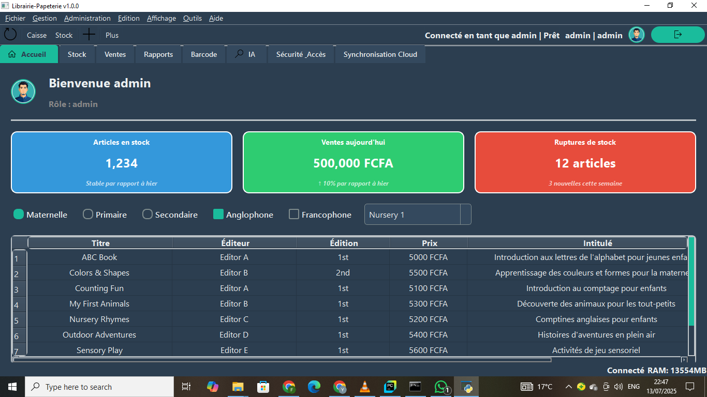

# 📚 Gestion Librairie & Papeterie 📝

Un système de gestion intuitif et complet pour les librairies et papeteries, conçu pour simplifier la gestion quotidienne des stocks, des ventes, des clients et des fournisseurs. Développé avec une interface utilisateur moderne et réactive grâce à **PySide** et **PyQt5**.

---

## ✨ Fonctionnalités

* **Gestion des Stocks :** Ajout, modification, suppression et recherche de livres et d'articles de papeterie. Suivi des quantités, des prix et des emplacements.
* **Transactions de Vente :** Enregistrement rapide des ventes, calcul automatique des totaux, gestion des retours et des remboursements.
* **Gestion des Clients :** Suivi détaillé des informations clients, de leur historique d'achats et de leurs préférences.
* **Gestion des Fournisseurs :** Enregistrement des détails des fournisseurs, suivi des commandes d'approvisionnement et des livraisons.
* **Rapports et Statistiques :** Génération de rapports sur les ventes, l'inventaire, les clients et les performances générales de l'entreprise.
* **Interface Utilisateur Graphique (GUI) :** Basée sur **PySide/PyQt5** pour une expérience utilisateur fluide, ergonomique et visuellement agréable.
* **Support QR Code :** Potentielle intégration pour la gestion des articles via **QR codes** (génération et/ou lecture).

---

## 🛠 Technologies Utilisées

* **Python 3.x**
* **PySide6 / PyQt5** (pour l'interface graphique)
* **SQLAlchemy** (ou autre ORM/bibliothèque de base de données pour l'interaction avec la base de données, par exemple SQLite pour le développement, ou PostgreSQL/MySQL pour la production).
* **Qt Designer** (pour la conception de l'interface utilisateur).
* **qrcode** (pour la génération de codes QR).
* **Pillow** (nécessaire pour la manipulation d'images, souvent une dépendance de `qrcode`).
* *(Optionnel) **opencv-python** : Si vous prévoyez d'intégrer une fonctionnalité de scan de QR codes via webcam.*

---


## 🚀 Installation et Lancement (Windows)

**⚠️ ATTENTION : Ce projet ne fonctionne qu'avec Python 3.12. Vous devez absolument avoir cette version installée, même si vous en avez une autre sur votre machine.**

### 1. Installation de Python 3.12

1.  **Téléchargez et installez Python 3.12** depuis le site officiel.
2.  **Très important :** Lors de l'installation, assurez-vous de cocher la case **"Add python.exe to PATH"**.
3.  Vérifiez que l'exécutable `py` est reconnu. Ouvrez votre terminal (PowerShell ou CMD) et tapez :
    ```bash
    py -0
    ```
    Cette commande devrait lister toutes les versions de Python installées, y compris le `3.12`.

### 2. Configuration du Projet

1.  **Cloner le dépôt :**
    ```bash
    git clone [https://github.com/yvanol-fotso/librairie_papeterie.git](https://github.com/yvanol-fotso/librairie_papeterie.git)
    cd librairie_papeterie
    ```

2.  **Se positionner à la racine du projet (là où se trouve le `src` et le `requirements.txt`) :**
    
    ✅ **1️⃣ Aller dans ton projet**
    
    ```bash
    cd C:\Users\fotyv\Documents\Boite\librairie_papeterie\librairie_papeterie 
    ```
    *(Ajustez ce chemin selon l'emplacement réel du dépôt sur votre machine)*

3.  **Créer et Activer l'Environnement Virtuel (venv) :**

    Utilisez explicitement la version 3.12 pour créer le `venv`.
    
    ✅ **3️⃣ Créer un venv avec Python 3.12**
    
    ```bash
    py -3.12 -m venv venv
    ```
    
    ✅ **4️⃣ Activer l’environnement**
    
    ```bash
    .\venv\Scripts\activate
    ```
    Quand c’est bon, vous verrez `(venv)` apparaître au début de votre ligne de commande, indiquant que l'environnement est actif.

4.  **Installer les dépendances :**
    
    ✅ **5️⃣ Installer les dépendances**
    
    ```bash
    pip install --upgrade pip
    pip install -r requirements.txt
    ```
    👉 **Avec Python 3.12, PySide6 va s’installer sans erreur.**

---

## 🚀 Lancement de l'Application

### Option A : Depuis PyCharm (Recommandé pour le Dev)

1.  **Ouvrir le projet dans PyCharm** et configurer l'interpréteur pour qu'il utilise le `venv` que vous venez de créer (voir section 💻 ci-dessous).
2.  Dans la structure du projet, faites un clic droit sur le fichier principal (qui se trouve dans le dossier `src`, par exemple `src/main.py` ou `src/app.py`).
3.  Sélectionnez "**Run 'main'**" (ou le nom de votre fichier).
4.  Pour arrêter, cliquez sur le bouton rouge **Stop** de la console de PyCharm.

### Option B : Depuis le Terminal (VS Code / CMD)

Puisqu'il n'y a PAS de `main.py` à la racine mais dans le dossier `src`, vous devez lancer le programme comme un module Python depuis la racine du projet (`librairie_papeterie`).

1.  Assurez-vous d'être à la **racine du projet** et que le `venv` est **actif** :
    
    ```bash
    C:\Users\fotyv\Documents\Boite\librairie_papeterie\librairie_papeterie>
    ```

2.  **Lancez le programme correctement :**
    
    ```bash
    python -m src.main
    ```
    
    💡 **Pourquoi ?** L'option `-m` traite `src.main` comme un chemin de module, permettant à Python de trouver le fichier `main.py` dans le dossier `src` et de lancer l'application.
    
    ❌ **Ne faites PAS** : `python src/main.py` (peut causer des problèmes d'importation de modules internes)
    
    ❌ **Ne faites PAS** : `python3.12` ou `python` (vous devez utiliser le venv activé)

---


## 💻 Configuration de l'Environnement de Développement (PyCharm)

Pour garantir un développement fluide et éviter les conflits de dépendances, il est recommandé d'ouvrir le projet dans PyCharm et de le configurer pour utiliser l'environnement virtuel (venv) créé précédemment.

1.  **Ouvrir le projet dans PyCharm :**
    Lancez PyCharm, cliquez sur "**Open**", puis sélectionnez le dossier racine du projet (`librairie_papeterie`).

2.  **Configurer l'interpréteur Python sur l'environnement virtuel :**
    * Accédez à : `File > Settings > Project: librairie_papeterie > Python Interpreter` (ou `PyCharm > Preferences > Project: librairie_papeterie > Python Interpreter` sur macOS).
    * Cliquez sur l'icône de la **roue dentée ⚙️** (en haut à droite de la section interpréteur) > "**Add...**"
    * Choisissez "**Existing environment**".
    * Indiquez le **chemin** vers votre environnement virtuel. Ce chemin pointe vers l'exécutable Python dans votre `venv` :
        * **Windows** : `.\venv\Scripts\python.exe`
        * **macOS/Linux** : `./venv/bin/python`
    * Cliquez sur **OK** pour valider.

3.  **Installer les dépendances automatiquement (si nécessaire) :**
    PyCharm devrait détecter automatiquement le fichier `requirements.txt` et vous proposer d'installer les dépendances manquantes. Si ce n'est pas le cas, ouvrez le terminal intégré de PyCharm (en bas de l'écran) et exécutez la commande suivante :
    ```bash
    pip install -r requirements.txt
    ```

4.  **Lancer l'application depuis PyCharm :**
    Dans la fenêtre de PyCharm, naviguez dans la structure du projet, faites un clic droit sur `main.py` (ou le fichier Python principal de démarrage de votre application), puis sélectionnez "**Run 'main'**".

✅ **Votre environnement est maintenant configuré proprement pour contribuer efficacement au projet !**

---

## 💡 Comment Contribuer

Nous accueillons avec plaisir les contributions ! Si vous souhaitez améliorer ce projet, veuillez suivre ces étapes :

1.  Faites un "fork" de ce dépôt sur votre compte GitHub.
2.  Créez une nouvelle branche pour votre fonctionnalité ou correction de bug :
    ```bash
    git checkout -b feature/nom-de-votre-fonctionnalite
    # ou
    git checkout -b bugfix/description-du-bug
    ```
3.  Commitez vos changements en écrivant des messages clairs et concis :
    ```bash
    git commit -m 'feat: Ajout de la fonctionnalité X'
    # ou
    git commit -m 'fix: Correction du bug Y'
    ```
4.  Poussez vos modifications vers votre dépôt forké :
    ```bash
    git push origin feature/nom-de-votre-fonctionnalite
    ```
5.  Ouvrez une "Pull Request" depuis votre dépôt forké vers le dépôt principal, décrivant en détail vos modifications et pourquoi elles sont utiles.

---


## Documentation et ressources

Vous trouverez ci-dessous des documents et captures d’écran illustrant les différentes versions de l’interface utilisateur ainsi que la documentation PDF associée.

### Documentation PDF

- [Documentation version 1 (PDF)](docs/docs_pdf/Librairie_Papetierie-V1.pdf)

### Captures d’écran de l’interface

#### Interface version 1  


---

## 📄 Licence

Ce projet est distribué sous la licence [**MIT License**]. Veuillez consulter le fichier `LICENSE` à la racine du dépôt pour plus de détails sur les conditions d'utilisation.

---